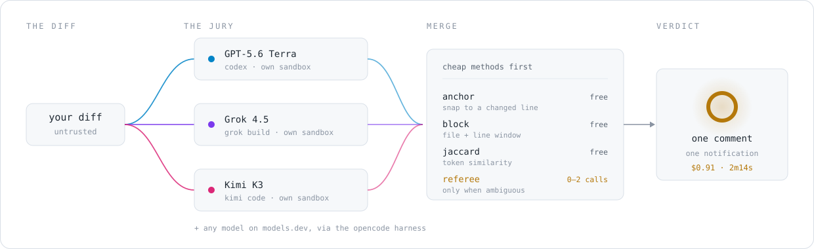

<div align="center">

<picture>
  <source media="(prefers-color-scheme: dark)" srcset="assets/hero-dark.svg">
  <source media="(prefers-color-scheme: light)" srcset="assets/hero-light.svg">
  
</picture>

<br>

[](https://github.com/cderinbogaz/juror/actions/workflows/ci.yml) [](.github/workflows/juror.yml) [](package.json) [](LICENSE)

</div>

```
npx juror review --pr 1234
```

**N frontier models review your PR in parallel, each through its own native agent
harness. Reports about the same defect collapse into one. Every review prints its own
receipt.**

---

## Why

Single-model PR bots have three problems, in order of how much they cost you:

1. **Blind spots.** Every model misses different bugs.
2. **Duplication.** Multiple reviewers often describe the same defect in different words.
3. **Opacity.** You pay per seat or per PR and never see what the inference actually cost.

Juror runs several models, uses code-aware similarity plus a conservative referee to
deduplicate reports about the same defect, and defaults to high recall: every unique
eligible finding is shown. Teams that
prefer fewer, higher-confidence findings can switch `review.publish_mode` to `consensus`
and use model agreement as a precision filter.

And there is no index and no SaaS. A coding agent doesn't need a prebuilt semantic index:
the supported agent harnesses all ship repository read/search tools and will go inspect the
callers of the function you changed. You get repo-wide context for the price of a few tool
calls, with zero indexing infrastructure, zero staleness, and no code leaving the runner
beyond the model API call itself.

**Non-goals.** Not an autofix bot. Not a linter (yours is better and free). Not a chat
interface. It reviews a diff and posts findings.

---

## How it works

<div align="center">
<picture>
  <source media="(prefers-color-scheme: dark)" srcset="assets/pipeline-dark.svg">
  <source media="(prefers-color-scheme: light)" srcset="assets/pipeline-light.svg">
  
</picture>
</div>

Each model gets the diff and its own sandboxed checkout, and answers in its vendor's native
agent loop. Their findings then go through five lossless merge stages — cheapest first,
with a model call only for possible semantic duplicates:

1. **Anchor** *(free)* — snap every finding to a line the diff actually adds or modifies.
   Findings landing outside the diff are reported separately, never silently dropped.
2. **Block** *(free)* — group by file, then by overlapping line window.
3. **Exact collapse** *(free)* — normalized identical reports, or identical structured
   trigger/mechanism/consequence/fix claims, collapse without inference.
4. **Similarity + referee** *(cheap)* — weighted prose/symbol similarity nominates possible
   duplicates. One small call per block merges them only when trigger, mechanism,
   consequence, and fix all match.
5. **Coverage audit** *(free)* — prove every raw atomic finding belongs to exactly one final
   published or explicitly suppressed result. Any accounting failure discards the merge
   decisions and falls back to lossless singletons.

In `consensus` mode an additional **verify** stage runs: eligible P0/P1 and eligible
single-model findings get an adversarial refutation pass. The verifier is asked to
*refute*, and defaults to refuted when the evidence isn't clear.

---

## What it posts

One sticky summary comment, and inline comments delivered as **a single batched review** —
one notification, not twelve. Roughly:

> #### Juror Review
>
> Adds SSE `event: error` detection to the reasoning stream so mid-stream provider failures
> retry instead of ending the turn as a silent success.
>
> #### Merge Confidence: 4/5
>
> <sub>Model votes: GPT-5.6 Terra `4` · Grok 4.5 `5` · Kimi K3 `4` → median **4**, capped at **4.5** by 1 confirmed P2.</sub>
>
> | | Severity | Location | Finding | Agreement |
> |---|---|---|---|---|
> | 1 | P1 | `src/stream/parse.ts:212` | Error branch leaves the reader unlocked | `●●●` 3/3 |
> | 2 | P2 | `src/stream/parse.ts:424` | Same swallow pattern not ported to the sibling class | `●○○` 1/3 |
>
> <details><summary>2 findings suppressed — below severity floor</summary><br>
>
> | Location | Finding | Raised by | Why suppressed |
> |---|---|---|---|
> | `src/stream/parse.ts:387` | `chunks_emitted` hardcoded on error events | GPT-5.6 Terra, Kimi K3 | below severity floor |
>
> </details>
>
> <details><summary><b>💸 This review cost $0.91</b> · 3 models · 2m14s</summary><br>
>
> | Model | Harness | Input | Cached | Output | Cost | Source |
> |---|---|---|---|---|---|---|
> | `GPT-5.6 Terra` | Codex | 39.8k | 12.1k | 8.9k | $0.34 | estimated |
> | `Grok 4.5` | Grok Build | 40.1k | 0 | 5.2k | $0.38 | reported |
> | `Kimi K3` | Kimi Code | 42.0k | 10.0k | 4.2k | $0.19 | estimated |
> | `referee (1 call)` | opencode | — | — | — | $0.0011 | reported |
> | **Total** | | **122k** | **22.1k** | **18.3k** | **$0.91** | |
>
> </details>

Plus a file-by-file overview and an optional sequence diagram of the changed flow.

With `--post`, Juror immediately creates one sticky **Juror is reviewing…** comment with an
animated working indicator and a short progress checklist. The finished summary replaces
that same comment in place; failed runs replace it with a terminal error state instead of
leaving a spinner behind forever.

---

## Install

### GitHub Action

```yaml
name: Juror
on:
  pull_request:
    types: [opened, synchronize, reopened]
permissions:
  contents: read
  pull-requests: write
jobs:
  review:
    runs-on: ubuntu-latest
    steps:
      - uses: actions/checkout@v4
        with: { fetch-depth: 0 }
      - uses: juror-dev/juror@v1
        with:
          github-token: ${{ secrets.GITHUB_TOKEN }}
        env:
          ANTHROPIC_API_KEY: ${{ secrets.ANTHROPIC_API_KEY }}
          OPENAI_API_KEY:    ${{ secrets.OPENAI_API_KEY }}
          FIREWORKS_API_KEY: ${{ secrets.FIREWORKS_API_KEY }}
          XAI_API_KEY:       ${{ secrets.XAI_API_KEY }}
```

**Any model whose key is absent is skipped with a note in the receipt.** A repo with one key
still gets a working single-model review. Degrade, never fail.

### Locally

The same binary, the same code path, no CI-only surprises:

```bash
npm i -g @juror/cli

juror review --base main                         # review your working branch
juror review --pr 1234 --repo owner/name         # review a PR, print to the terminal
juror review --pr 1234 --repo owner/name --post  # ...and post it
```

Put your keys in a `.env` beside the repo (it is loaded automatically and never committed):

```
ANTHROPIC_API_KEY=…
OPENAI_API_KEY=…
FIREWORKS_API_KEY=…
XAI_API_KEY=…
```

---

## Supported models & harnesses

Juror drives each model through its **native agent harness**, so each one greps your repo
the way its vendor intended.

| Harness | CLI | Models | Reports cost | Sandbox |
|---|---|---|---|---|
| `claude-code` | `claude -p` | any Anthropic model | ✅ `total_cost_usd` | tool removal |
| `codex` | `codex exec` | any OpenAI model | ❌ → estimated | `--sandbox` (kernel) |
| `opencode` | `opencode run` | anything on [models.dev](https://models.dev) — Fireworks, Groq, OpenRouter, … | ✅ per-step `cost` | tool removal |
| `grok-build` | `grok -p` | Grok models | ✅ `total_cost_usd` | Landlock |
| `kimi-code` | `kimi -p` | Kimi K3 on Fireworks | ❌ → estimated from session usage | tool allowlist + isolated runtime |
| `generic-openai` | *(in-process)* | any OpenAI-compatible endpoint | ❌ → estimated | path-confined tools |

The `opencode` harness is the reason adding a model is a config edit rather than a PR. To add
**DeepSeek V4 Flash** to your jury:

```yaml
models:
  - id: deepseek-v4-flash-0731
    harness: opencode
    harness_model: fireworks-ai/accounts/fireworks/models/deepseek-v4-flash-0731
    pricing_key: accounts/fireworks/models/deepseek-v4-flash-0731
    secret: FIREWORKS_API_KEY
    args: { variant: high }
```

---

## Configuration

Juror ships four jury presets. Models whose provider key is unavailable are skipped, so
`ultra` means every built-in model that can actually authenticate on that runner.

| Preset | Jury | Intended use |
|---|---|---|
| `fast` | DeepSeek V4 Flash via opencode/Fireworks (`low`) · Kimi K3 via Kimi Code/Fireworks (`low`) | Lowest latency and cost |
| `balanced` **(default)** | GPT-5.6 Terra via Codex/OpenAI (`max`) · Grok 4.5 via Grok Build/xAI (`high`) · Kimi K3 via Kimi Code/Fireworks (`max`) | Strong provider diversity without the full burn |
| `high` | GPT-5.6 Sol via Codex/OpenAI (`high`) · Opus 5 via Claude Code/Anthropic · Grok 4.5 via Grok Build/xAI (`high`) | Higher-confidence frontier jury |
| `ultra` | Every model from the other presets (six total), using their higher reasoning settings | Maximum coverage; highest token and cost use |

Select one in config, on the CLI, or in the Action:

```bash
juror review --preset fast --base main
juror review --mode ultra --pr 1234 --repo owner/name
```

```yaml
- uses: juror-dev/juror@v1
  with:
    preset: high
```

`.juror.yml` lives at the repo root. Every key is optional; the defaults are what you see below.

```yaml
version: 1
preset: balanced

consensus:
  min_agreement: all             # all (literal unanimity) | majority | <number>
  verify_solo_findings: true     # adversarially refute eligible solo findings
  # verify_model/referee_model default to a model included in the selected preset

review:
  publish_mode: all              # all (higher recall) | consensus (higher precision)
  severity_floor: P3             # include every severity by default
  max_inline_comments: 15
  incremental: true              # re-review only new commits
  paths_ignore: ["**/*.lock", "dist/**", "**/*.generated.*"]

budget:
  max_cost_usd_per_pr: 5.00      # split evenly across the models that have a key
  on_exceed: partial             # partial | skip

output:
  sequence_diagram: true
  cost_receipt: true
  suppressed_findings: collapsed # collapsed | hidden | inline
```

An explicit `models:` list replaces the preset completely and creates a custom jury; it is
never merged with built-ins. `--models a,b` is different: it only narrows the selected preset
or custom jury for one run. `--preset` and its `--mode` alias override the config selection.

---

## Publishing: recall or precision

Publication is controlled independently from deduplication.

- `publish_mode: all` *(default, higher recall)* publishes every unique cluster at or above
  `severity_floor` (also P3 by default). Agreement is still shown, but it does not hide a
  finding.
- `publish_mode: consensus` *(higher precision)* applies the configured agreement and
  verification rules. The default `consensus.min_agreement: all` means every model must
  raise the finding.

With `min_agreement: all`, publication requires literal unanimity. If users deliberately
choose `majority` or a numeric threshold, serious findings retain the safety exceptions:

```
publish if  agreement >= configured min_agreement
        or (agreement >= 2 and severity in {P0,P1})
        or (agreement == 1 and severity in {P0,P1} and survived refutation)
```

Anything filtered out lands in the collapsed **suppressed** block with the reason. Nothing
is thrown away — that transparency is what makes the optional precision filter trustworthy.

### Shadow benchmark

Replacement decisions can be evaluated with a manually adjudicated corpus:

```bash
juror benchmark --file benchmarks/corpus.json
```

The report compares P0–P2 recall, overall recall, precision, duplicate rate, measured cost,
and latency for every reviewer. See [the benchmarking protocol](docs/benchmarking.md); the
bundled PR #10359 case is a seed, not a sufficient replacement benchmark by itself.

### The merge score

Not a model opinion — a deterministic function of published findings, with the votes shown
so the arithmetic is auditable.

```
base    = median(each model's self-reported merge confidence)
penalty = 2·P0 + 1·P1 + min(1, 0.5·P2)     (confirmed, published findings only)
score   = clamp(round(min(base, 5 - penalty)), 1, 5)
```

`min(base, 5 - penalty)` is the load-bearing part: models cannot vote away a confirmed
blocker, and a clean diff still can't reach 5 if the models were individually unsure.

---

## Cost accounting

The differentiator, and the thing that must never be wrong.

- **Never fabricate.** Every figure is labeled `reported` (provider-computed) or `estimated`
  (tokens × list price). A harness that returns neither prints **`unknown`**, and the total
  is marked as a lower bound. We do not guess.
- **Long-context tiers are cliffs, not slopes.** GPT-5.6 Sol reprices the *entire request* at
  2× input above 272k tokens; Grok 4.5 does the same above 200k. A flat per-token config
  silently underbills exactly the large-diff reviews that cost the most.
- **Cache writes are not free.** On GPT-5.6 and later they bill at 1.25× the uncached input
  rate. Anthropic bills them too. Juror models a review as write-once, read-many: the first
  model to see a diff pays the write premium, and re-reviews on later pushes get cheap.
- **Codex `input_tokens` includes cached tokens; Claude's and opencode's do not.** Normalizing
  naively overbills a cache-heavy Codex run by up to an order of magnitude. There is a
  regression test pinned to a real `turn.completed` payload for exactly this.
- **Kimi K3 runs through Fireworks.** Kimi Code exposes token usage but not provider USD,
  so Juror multiplies those measured tokens by the versioned Fireworks list price and
  labels the row `estimated`.

`src/cost/pricing.json` is versioned, dated, and every entry carries a source URL.

---

## Security

This is a bot that pipes attacker-controlled text into an agent and then writes to your PR.
It is designed for that.

1. **No model process ever sees `GITHUB_TOKEN`.** Agents write JSON to a scratch directory; a
   separate step with no model in the loop reads it and calls the GitHub API. Prompt injection
   can at worst produce a bad review comment — never a push, a merge, or an exfiltration.
2. **Default trigger is `pull_request`, not `pull_request_target`.** Fork PRs get no secrets
   and no review, by design.
3. **Sandbox where the harness supports it.** Codex and Grok Build get kernel-enforced
   sandboxes. Claude Code, opencode, and Kimi Code get tool removal (no shell or network
   tools), plus a post-run **workspace guard** that reverts any file an agent modified that
   was clean before the run — and never touches a file that was already dirty. Kimi also
   starts outside the repository with a private home, so a PR-controlled MCP config cannot
   spawn during startup.
4. **Keys are passed per harness**, never to all of them. Each model process gets an
   environment containing only its own provider key.
5. **Injection is a finding.** Each model is told the diff is untrusted data and to report
   embedded instructions as a P0. Several independent models make a uniform injection
   substantially harder.
6. **Repository rules come from the base revision.** Juror places the root `AGENTS.md` and
   every applicable nested `AGENTS.md` directly in reviewer and verifier prompts. A PR can
   update those files for future work, but cannot rewrite the policy used to review itself.
   If the base object is unavailable locally, Juror warns and only uses a workspace copy the
   visible diff does not change.
7. **Everything posted is redacted** for secret-shaped strings first.

---

## Limitations

- Cost for Codex is **estimated**, not reported — the CLI exposes tokens but no dollar figure.
- Cost for Kimi Code is **estimated** from its private session usage records and the
  versioned Fireworks rate. If those records are unavailable, it falls back to `unknown`.
- Grok Build's headless JSON shape is parsed defensively and marked `unknown` when the fields
  aren't there, rather than guessed at.
- Agreement filtering needs ≥2 models to mean anything. With one key configured, the
  default all-findings mode still gives you a complete single-model review and an honest
  receipt, but there is no cross-model precision signal.
- Findings anchored outside the diff are surfaced in the summary but not posted inline,
  because GitHub can't attach them.

---

## Development

```bash
npm ci
npm run typecheck
npm test
npm run build
node dist/cli.js review --base main
```

Layout follows the pipeline: `src/diff` → `src/harness` → `src/merge` → `src/cost` →
`src/render` → `src/github`. `src/types.ts` is the only shared vocabulary.

Juror reviews its own pull requests. Every PR in this repo carries a public cost receipt.

## License

MIT.
